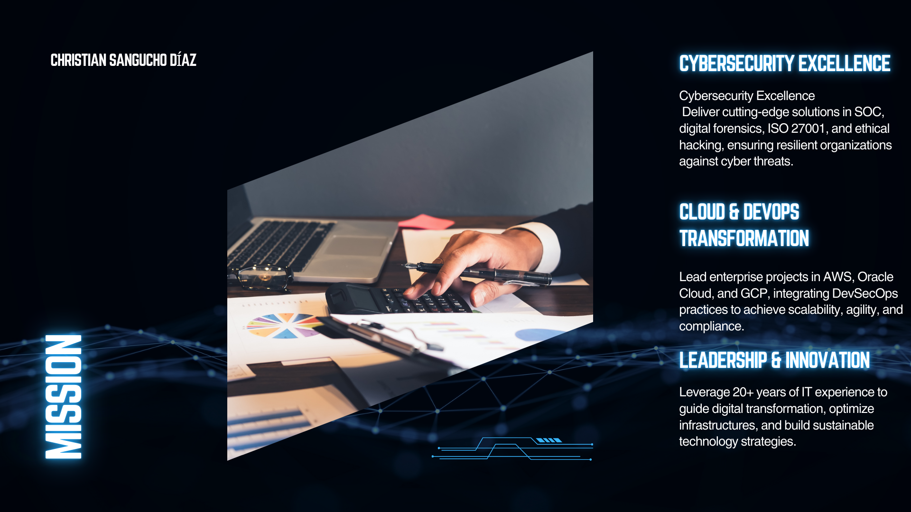

# 👋 Hi, I’m Christian Sangucho  

## 🚀 Professional Profile  
IT Engineer with more than 20 years of experience in **infrastructure, information security, DevOps, and digital transformation projects**.  
Currently pursuing a **Master’s Degree in Cybersecurity** at UIDE, with a focus on **digital forensics, reverse engineering, mobile security, DevSecOps, and ISO/IEC 27001**.  

---

## 🎯 Areas of Expertise  
- 🔐 Cybersecurity (ISO 27001, Wazuh SOC, security audits, digital forensics)  
- ☁️ Cloud Computing (AWS, Oracle Cloud, GCP)  
- ⚙️ DevOps & Automation (CI/CD, Docker, Kubernetes, GitHub Actions, Jenkins)  
- 🖥️ Infrastructure & Virtualization (VMware, Synology NAS, corporate networks)  
- 📊 Governance & Compliance (SERCOP, ITIL, technology risk management)  

---

## 🏆 Education & Certifications  
- 🎓 Master’s in Cybersecurity – **Universidad Internacional del Ecuador (UIDE)**  
- 📜 ISO/IEC 27001 Internal Auditor  
- ☁️ AWS Solutions Architect – Associate *(in progress)*  
- 🛡️ Specialized courses in **DevSecOps, digital forensics, and ethical hacking**  

---

## 📌 Featured Projects  
- 🔎 **SOC with Wazuh** – Real-time monitoring and event correlation  
- 📡 **Migration to Oracle Cloud** – Institutional interoperability  
- 🏦 **POC for COBIS core banking migration to GCP**  
- 💊 **IaaS Infrastructure for national pharmaceutical auctions**  
- 🔑 **Vulnerability Assessments and Ethical Hacking** for public and private institutions  

---

## 📫 Contact  
- 🌐 [LinkedIn](https://www.linkedin.com/in/christian-sangucho-d%C3%ADaz-777443167/)  
- 📧 christian.casd@gmail.com  
- 🏢 Founder @ **GroupIT S.A.S.** – *"Your technology, our responsibility"*  
